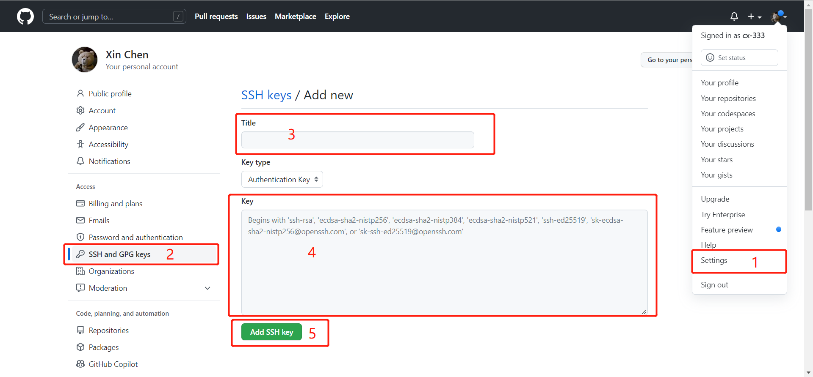

# 独立 Git 下载
[Git下载网址](https://git-scm.com/downloads)  
进入网址后，选择相应的系统进行下载，下载完成后按照提示进行安装即可。安装完成后，在搜索栏搜索**git bash**，如果有并可打开，则说明安装成。

# 如果用的是Visual Studio Code, 则无需再下载Git，VS Code 自带Git集成

# 安装后的用户配置

安装完成后，打开**Git Bash**或**Visual Studio Code**。在终端输入以下命令，配置全局（整个计算机的）用户名和邮箱地址。
```shell
git config --global user.name "<username>"
# username 可以任意取， 例：cs123
git config --global user.email "<email address>"
# email address 为邮箱地址，例：xxx@xx.com
```

# 配置远程仓库(Github)

 * 第一步：创建 SSH Key
 ```shell
 ssh-keygen -t rsa -C "<email address>"
 # 然后一路回车
 ```
如果一切顺利的话，可以在用户主目录里找到.ssh目录，里面有id_rsa和id_rsa.pub两个文件，这两个就是SSH Key的秘钥对，id_rsa是私钥，不能泄露出去，id_rsa.pub是公钥，可以放心地告诉任何人。
 * 第二步：登陆GitHub，打开“Account settings”，“SSH and GPG Keys”页面
 * 第三步：然后，点“Add SSH Key”，填上任意Title，在Key文本框里粘贴id_rsa.pub文件的内容
 
