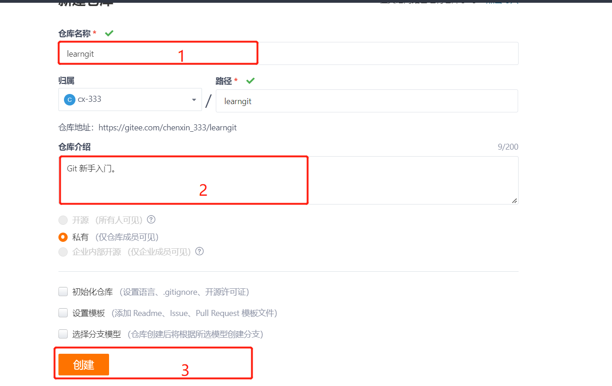
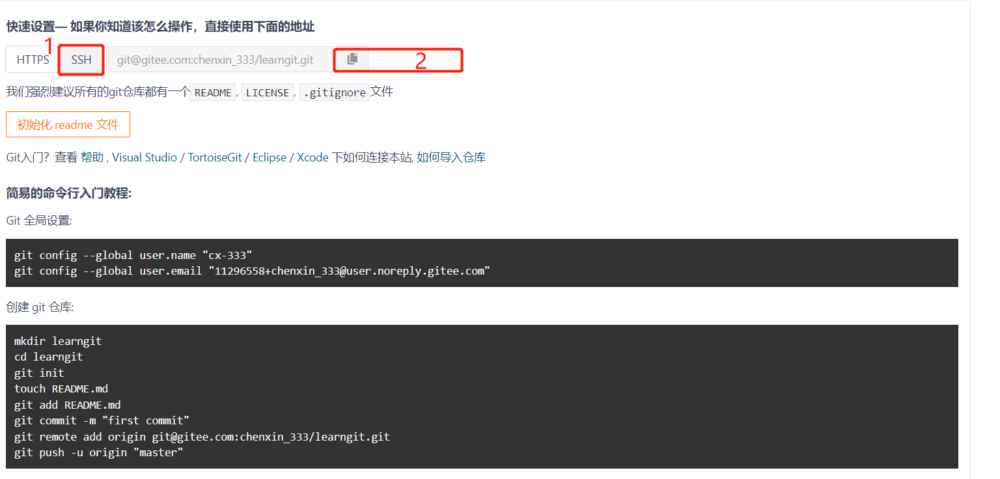

# 场景 1：新建一个空的Gitee仓库，并将本地仓库推送到远程Gitee仓库。
* step 1: 进入[Gitee](https://gitee.com/)官网，登录账户。
* step 2: 点击创建**我的仓库**。按要求输入信息后点击创建。
* step 3: 点击**SSH**，然后复制SSH地址。
* step 4: 如果自己已有仓库的话，则进入自己本地仓库目录，然后依次输入以下命令。
```shell
cd <existing repository>
# <name> 任意字符，<SSH address> 为复制的SSH地址
# <commit message> 任意字符
git remote add <name> <SSH address>
git push -u <name> "<commit message>"
# 此时，远程仓库和本地仓库建立连接，如果再有改动，则直接输入以下命令即可向远程仓库实现推送
git push <name> master "<commit message>"
```
如果本地也没有仓库的话，则先初始化自己的仓库，然后再远程推送，按照以下命令实现。
```shell
mkdir learngit
cd learngit
git init 
touch README.md
git add README.md
git commit -m "first commit"
git remote add origin git@gitee.com:chenxin_333/learngit.git
git push -u origin "master"
```
Github与Gitee类似。

# 场景 2：
进入新建的仓库文件夹（待初始化的仓库）。

常用命令及其解释
```shell
# 初始化仓库
git init 
# 提交文件至暂存区
git add <filename>
# git add . 添加所有文件至暂存区
# 连接远程仓库
git remote add <name> <git-ssh>
#<git-ssh> example: git@github.com:cx-333/learngit.
# 提交文件至仓库
git commit -m '<commit message>'
# first push to github
git push -u <name> master
# later push
git push <name> master
# 查看仓库当前状态
git status
# 当github库与本地库不相同时，需要先pull，然后push
git pull <name> master
git push <name> master

# 相对引用 ^ 向上移动一个提交记录， ~<num> 向上移动多个提交记录，如 ~3

# 强制修改分支位置
git branch -f <branch name> HEAD~<num>
git branch -f <branch name> <node name>

# 撤销变更
git reset HEAD~1
git revert HEAD 

# 整理提交记录
git cherry-pick <node name>

# 交互式 rebase
git rebase -i HEAD~4

#本地栈式提交

```

